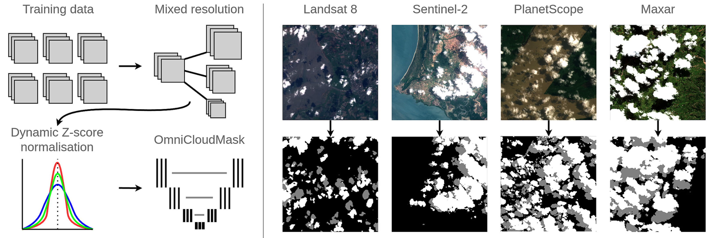
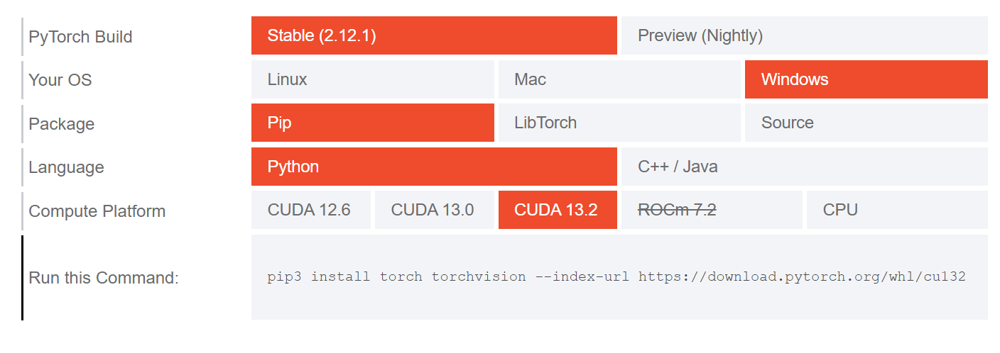

# Cloud and Cloud Shadows Masking

## OmniCloudMask
OmniCloudMask is a Python library for cloud and cloud shadow detection in high to moderate resolution satellite imagery. 



OmniCloudMask produces segmentation masks with four classes.


| Value    | Class         |
| -------- | --------      |
| 0        | Clear         |
| 1        | Thick cloud   |
| 2        | Thin cloud    |
| 3        | Cloud shadow  |

For more information about the OmniCloudMask, please review the [paper](https://www.sciencedirect.com/science/article/pii/S0034425725000987).


## Why OmniCloudMask?
- Works with any imagery containing Red, Green, and NIR bands (10 m to 50 m resolution, and down to 5 m with recent models)
- Any processing level (L1C, L2A, TOA, and surface reflectance)
- Validated on Sentinel-2, Landsat 8, PlanetScope, and Vantor (previously Maxar) imagery
- Supports CUDA, MPS (Apple Silicon), and CPU inference
- Optional confidence map export
- Fast inference with multi-threaded patch-based processing


# Create a Python Environment
The first thing to do is create a new Python environment. You can use Anaconda to create a environment. Make sure to create an environment with Python 3.9 or higher. I personally recommend to setup environment with Python 3.12 (or higher).
- Open Anaconda Prompt.
- Type the following command to create a new Python environment, cloudmask, with Python 3.12. 

    ```bash
    conda create -n cloudmask python==3.12
    ```
- Press `y` when you are asked to proceed. The cloudmask environment will be created within a minute or so.
- Before installing OmniCloudMask, install few of the Python package that are required for successful installation of OmniCloudMask.
    ```bash
    pip install six numpy matplotlib pandas plotly scipy rasterio jupyterlab
    conda install -c conda-forge gdal
    ```
- Go to [PyTorch installation page](https://pytorch.org/get-started/locally/) and install torch with CUDA support. Select the appropriate compute platform that matches with you compute specs. Use `nvidia-smi` command in the Terminal to check info about GPU and CUDA version available in your machine.
    
    ```bash
    pip install torch torchvision --index-url https://download.pytorch.org/whl/cu132
    ```
- You can now install OmniCloudMask package in the cloudmask environment.
    ```bash
    pip install omnicloudmask
    ```
    The OmniCloudMask package will be installed along with all the dependency packages.
- With this, the Python environment, `cloudmask`, is ready for cloud and cloud shadow masking task.

> If you have an existing environment with Python > 3.9, you can install OmniCloudMask in it. This can save some storage space in your computer. For example, OmniCloudMask can be installed in the rio environment that we widely use for vegetation monitoring projects.
> - It should be noted that installing any new package in the existing environment can sometimes update the version (upgrade/downgrade) of existing packages that are already installed in that particular environment. This can sometimes create problems such as version conflict issues and scripts throwing error out of nowhere due to package version change. 
>
>There are several free (and open source) IDE that can be used for Python scripting, such as Spyder, VS Code,  PyCharm Community Edition and Eclipse.

>If the kernel crashes when plotting the image, uninstall matplotlib and numpy packages and re-install them. If the kernel keeps on crashing even after re-installing the packages, please chat with Sumesh.
>```bash
>pip uninstall matplotlib numpy
>pip install matplotlib numpy==2.4.6
>```


<!-- TODO: add basic instructions to use OmniCloudMask @kcsumesh25 look at [#1](https://github.com/kcsumesh25/cloud_masking/issues/1) -->